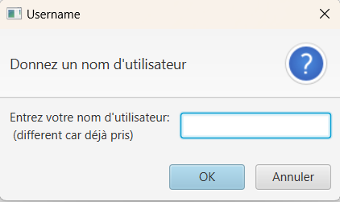
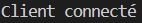
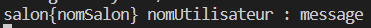

# Chat

## Table of Contents

- [Chat](#chat)
  - [Table of Contents](#table-of-contents)
  - [Introduction ](#introduction-)
  - [Quoi installer ](#quoi-installer-)
  - [Lancer ](#lancer-)
  - [Fonctionnalitées ](#fonctionnalitées-)
    - [Ip inconnue](#ip-inconnue)
    - [Nom d'utilisateur](#nom-dutilisateur)
    - [Salon Général](#salon-général)
    - [Home](#home)
    - [new salon](#new-salon)
    - [Tous les salons](#tous-les-salons)
    - [Users connectés](#users-connectés)
    - [Message privé](#message-privé)
    - [Uptime](#uptime)
    - [Quit](#quit)
    - [Help](#help)
  - [Explication des fonctionnalitées](#explication-des-fonctionnalitées)
    - [Username unique](#username-unique)
    - [Saisie adresse ip](#saisie-adresse-ip)
    - [Les boutons de l'ihm](#les-boutons-de-lihm)
    - [Message privé](#message-privé-1)
  - [Explication du code ](#explication-du-code-)
    - [Le serveur](#le-serveur)
    - [Deco](#deco)
  - [Les messages](#les-messages)
  - [Session](#session)
  - [ServeurEcouter](#serveurecouter)
    - [ServeurGestSalon](#serveurgestsalon)
    - [ServeurEnvoie](#serveurenvoie)
    - [L'IHM](#lihm)
    - [Le client](#le-client)
  - [Javadoc ](#javadoc-)
  - [Membres ](#membres-)

## Introduction <a name = "about"></a>

Ce projet est un chat pour le projet de SAE dans le cadre du diplome de BUT informatique. Il s'agit d'un chat simple avec un serveur et un client.

## Quoi installer <a name = "getting_started"></a>

Pour lancer ce projet, vous devez installer java et javaFX.

## Lancer <a name = "usage"></a>

Lancer le serveur avec la commande suivante :

```bash
java -jar Serveur.jar
```

Sur un autre terminal, lancer le client avec la commande suivante :

```bash
java --module-path "{JAVAFX_DIR}\lib" --add-modules javafx.controls,javafx.fxml -cp bin launch.ChatApplication
```

Une fois le client lancé, vous pouvez vous connecter avec un pseudo. Et utiliser la commande /help pour voir les commandes disponibles.
Pour ce connecter sur un autre ordinateur sur le même réseau, lancer <code> /ip </code> pour avoir l'adresse ip du serveur.   
Ensuite, lancer le client sur l'autre ordinateur et quand l'adresse ip est demandée, entrer l'adresse ip obtenue grâce au client local.

Vous pouvez maintenant découvrir le chat.

## Fonctionnalitées <a name = "fonctionnali"></a>
### <font color="red">Ip inconnue</font>
On peut renseigner l'ip du serveur si elle n'est pas connu.

### <font color="red">Nom d'utilisateur</font>
Le nom d'utilisateur est unique. Si un utilisateur tente de se connecter avec un nom déjà utilisé, il lui est demandé d'en choisir un autre.

### <font color="red">Salon Général</font>
Ce salon permet de discuter avec tous les utilisateurs connectés. Il est accessible par défaut.Et envoie le message à tous les autres salons.

### <font color="red">Home</font>
Quand clique sur le bouton home, on revient en mode chat salon.

### <font color="red">new salon</font>
Nous avons décidé que les salons sont créés par les utilisateurs.
Quand appui sur bouton "nouveau salon", on saisie le nom du salon que l'on veut créer. Si il n'est pas déjà pris cela le créer et on est ajouté dedans et déconnecté de l'ancien salon.

### <font color="red">Tous les salons</font>
Quand appui sur bouton "tous les salons", on peut voir tous les salons existants. On peut cliquer sur un salon pour y accéder.

### <font color="red">Users connectés</font>
Quand on appui sur le bouton "Messages privés", on peut voir tous les utilisateurs connectés. On peut cliquer sur un utilisateur pour lui envoyer un message privé.
Avec la commande <code> /nbuser </code> on peut voir le nombre d'utilisateurs connectés.

### <font color="red">Message privé</font>
Pour envoyer le premier message privé à une personne cliquer sur "Messages privés" puis sur le nom de l'utilisateur avec qui on veut discuter. 
La personne reçois un message le bouton message privé devient rouge. Et le nom de la perssonne qui à envoyer aussi.
Pour répondre utiliser le textField du bas.

- To Do: Faire en sorte que les messages privéee soit visiible sans rechager le chat privé.

### <font color="red">Uptime</font>
Permet de voir le temps qu'un salon existe.

### <font color="red">Quit</font>
Quand on quitte le chat, par la croix ou par la commande <code> /quit </code>, on est déconnecté du serveur et on peut se reconnecter avec un autre pseudo (le pseudo actuel est libéré).

### <font color="red">Help</font>
<code> /help </code> permet d'avoir la liste des commandes disponibles.

## Explication des fonctionnalitées
### <font color="red">Username unique</font>
Quand un user lance son client, il se trouve dans le salon <code> config</code>. Quand un user fait la commande <code> /username nomUtilisateur </code> (cela ce fait automatiquement), le serveur renvoie si le nom est déjà pris par une personne connecté. Si il est déjà pris, une nouvelle pop up s'affiche demandant un nouveau username. 

### <font color="red">Saisie adresse ip</font>
Quand le client ce connect, il essaye de ce connecté à l'adresse ip localhost. Si sur cette adresse il n'y a pas le serveur, une pop demandant l'adresse ip du serveur est affiché et si on donne la bonne adresse la connexion au serveur ce fait.

### <font color="red">Les boutons de l'ihm</font>
Quand on clique sur les boutons de l'ihm, cela envoie la commande correspondant au serveur est attend le retour pour pouvoir afficher ce qu'il faut.

### Message privé
Les messages privés avec une personne sont stocké en cache chez les clients.

## Explication du code <a name = "explication"></a>
### Le serveur
Un serveur demande pour être instancié un port.
Lorsque le serveur est lancé si le port 5001 est disponoble alors le message  est affiché, le serveur ce lance sur l'addresse ip <code> localhost</code>. Sinon le message <code> Erreur lors de la création du serveur </code> est affiché.  
Lors de son instantiation le serveur est initié avec deux salons: Geneneral et Config. 
Puis la fonction <code> launch() </code> permet d'attendre les <font color="ff726f">connexions des clients</font>. Quand un client ce connecte, une nouvelle [session](#session) est instanciée et le message  est affiché. Si il y a une erreur le message <code> Erreur lors de la connexion d'un client </code> est affiché.  
Quand cette session est instanciée, elle est ajoutée à la liste des sessions connectées.

### Deco
Prend en paramètre un socket et un salon.
Cette fonction lance un thread [ServeurGestSalon](#ServeurGestSalon) qui permet de gérer les salons. Ce thread est instancié avec les paramètres <code>oldSolon: salon</code>, <code>socket: socket</code>, <code>serveur: le serveur actuel</code> et <code>action: "deco" </code>.

## Les messages
Un message envoyé du client vers le serveur ressemble à ceci: .  
Le serveur va traiter l'en-tête du message pour connaitre le nom d'utilisateur, le salon et l'action à effectuer(message est une commande ou un message).

## Session
Une session demande pour être instanciée un socket et un serveur.   
Lors de son instantiation, la session est initiée avec un <font color="ff726f">nom</font> <code> Anonyme</code>, un nouveau thread [<code> ServeurEcouter </code>](#ServeurEcouter) est instancié et lancé.

## ServeurEcouter
Le thread <code> ServeurEcouter </code> demande pour être instancié un socket et un serveur.
Ce thread permet d'écouter les messages envoyés par le client. Son constructeur associe un <code> out </code> qui est un <code> PrintWriter </code> et un <code> in </code> qui est un <code> BufferedReader </code> au socket.  
Le <code> run() </code> permet d'écouter les messages envoyés par le client. Si le message est <code> /quit </code> alors le client est déconnecté grâce à la fonction [<code> deco </code>](#deco) du serveur et le out est fermé. 
Tant que le message ne fini pas par "/quit" alors le message est écrit dans le terminal du serveur pour tous déboguage. Par la suite on regarde si le message correspond à une commande. Cette vérification est est faites avec la fonction <code> matches() </code> de la classe <code> String </code>, elle vérifie si un message correspond à celui rentré en paramètre, si l'on ne veut pas qu'une partie du message soit toujours le même on met un <code> .* </code> à la place de la partie variable.

### ServeurGestSalon
Thread qui permet de gérer des actions à effectuer sur un salon (création, suppression, ajout d'un utilisateur, suppression d'un utilisateur, ...).

### ServeurEnvoie
Thread qui permet d'envoyer un message. Ce thread est instancié à chaque fois qu'un message est envoyé.

### L'IHM
Les cliques sur les boutons de l'IHM envoie des commandes et le retour de cette commande est géré.

### Le client
Le client instancie 2 thread un pour écouter et un pour envoyé.

## Javadoc <a name = "javadoc"></a>
La javadoc est disponible dans le dossier <code> docs </code> du projet. Pour la lancer il faut ouvrir le fichier <code> index.html </code> dans un navigateur.

## Membres <a name = "contributor"></a>
Paul JUPILLIAT
Benjamin GUERRE
